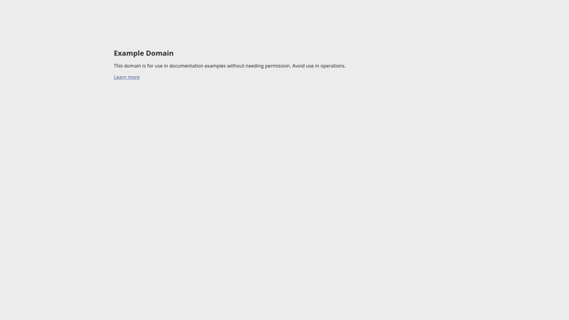
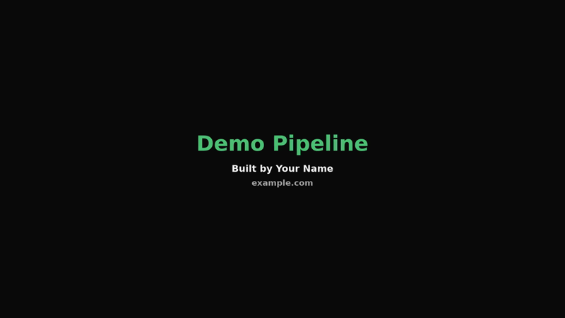

# demo-pipeline

Narrated screen-recording demo videos for any web app, rendered from a config file.

You write the narration and describe the scenes. The pipeline generates the voiceover, drives a real browser through your app in time with it, and cuts the result together with intro and outro cards. Narration is cached per scene, so once a render has happened, re-running it reproduces the same video and changing one line means re-rendering rather than re-recording the whole take.

Built for product demos, launch clips, onboarding walkthroughs, conference submissions, and anything else where you would otherwise open a screen recorder and fumble the first take. The reason to reach for it over a screen recorder is that the video becomes a build artifact: it lives in version control, it regenerates when the app changes, and it can run in CI.

**Before you clone it:** you need Python 3.10+ and ffmpeg. ffmpeg can come from your system or from the `bundled-ffmpeg` extra, which ships prebuilt binaries. Narration comes from OpenAI by default and is billed per character, but that is not a hard requirement — point scenes at audio files you already have, or pass your own `tts` callable, and no key is read at all. Installation is from git; there is no PyPI package yet. Everything has been tested on **Linux only**; the default backend should work on macOS and Windows but has not been run there, and the `xvfb` backend is Linux-only by design.

## What it produces


**[Watch the full video (2m26s, 1080p, narrated)](https://github.com/LibruaryNFT/demo-pipeline/releases/latest/download/oneconsensus-demo.mp4)** — attached to the [latest release](https://github.com/LibruaryNFT/demo-pipeline/releases/latest), because video does not belong in git history. The GIF above is silent, downscaled, and stitched from two moments of it.

A real hackathon submission, start to finish without a human touching a screen recorder: title card, landing page, a scroll through the agent lineup, navigate to the evaluation view, pick an asset, run it, sit on the result while the narration explains it, then the performance page and a closing card. Eleven scenes in two and a half minutes.

It was made with this package's direct predecessor — same Playwright-plus-TTS-plus-ffmpeg approach, but hand-timed, with the scene boundaries written as comments and the waits tuned by re-rendering until the narration lined up. Turning that into scenes you declare, and timings the tool derives from the audio, is what demo-pipeline is.

### Stills from the same render

| | |
|---|---|
|  |  |
| Intro card, generated from `name` + `Branding.tagline` | A scene: the browser driven through the app, holding on the result the narration is describing |



Outro card. Each line comes from a `Branding` field and is skipped when blank, so this same code renders a one-line card or the four-line one above.

## Status

Working and used, but young. What has actually been exercised, so you know where the edges are:

- Both backends verified end to end on Linux, output inspected frame by frame.
- The `playwright` backend is cross-platform *by construction* (Playwright's own recorder plus ffmpeg, with per-OS font defaults). It has **not** been run on macOS or Windows. If you are the first, expect the font path to be the thing that needs attention.
- Exercised on a real production SPA as well as simple public pages. The hardest check was a port: a 13-scene, 3-minute tour that a predecessor script had already produced was rebuilt as a config and re-rendered here, matching the original's runtime to the microsecond.
- For a heavy SPA, raise `timing.settle_s` rather than switching `wait_until` to `networkidle`. That was the original advice here and testing contradicted it — an app that polls never goes idle, so `networkidle` burns the full timeout and fails the scene. The default `domcontentloaded` plus a longer settle is the reliable combination.
- Narration costs money. OpenAI TTS is billed per character, so a 60-second script is fractions of a cent, but a render loop with the cache disabled is not free.

## How it works

Three stages. Each is independently usable if you only need part of it.

```
[narration text]          [scenes + actions]         [branding / cards]
       |                          |                          |
       v                          v                          v
   audio.py                  recording/                  compose.py
   ---------                 ----------                  ----------
   OpenAI TTS                browser automation          ffmpeg concat
   cached per scene          timed to the audio          title cards
   -> .mp3 per scene         -> screen capture           -> final .mp4
```

Scene length is driven by how long its narration takes to speak. The recorder runs each scene's action, then holds until that scene's absolute end time, so a slow click steals from its own scene rather than pushing everything after it out of sync.

## Install

Requires Python 3.10+ and ffmpeg. An OpenAI API key is the default narration source but not a requirement — see [Narration](#narration-caching-and-not-needing-an-api-key).

```bash
python -m venv .venv
.venv/bin/pip install -e ".[dev]"
.venv/bin/python -m playwright install chromium
export OPENAI_API_KEY=...    # or put it in .env (gitignored)
```

No ffmpeg on the machine, or no way to install one? Take the bundled build instead:

```bash
.venv/bin/pip install -e ".[dev,bundled-ffmpeg]"
```

A system ffmpeg on PATH is always preferred when there is one — it is usually newer and more completely configured. The bundled build is a fallback, and `doctor` says which one is in use. Note it ships ffmpeg without ffprobe, so durations get parsed out of ffmpeg's own banner instead, which is accurate to a centisecond rather than a microsecond.

That is everything the default `playwright` backend needs. The `xvfb` backend additionally wants a virtual X server and a real Chrome, which is Linux only:

```bash
sudo apt install xvfb ffmpeg      # plus Google Chrome from its own package
```

Check your setup before rendering anything:

```bash
.venv/bin/python -m demo_pipeline.doctor          # playwright backend
.venv/bin/python -m demo_pipeline.doctor --xvfb   # also the xvfb stack
```

It checks each dependency in isolation — ffmpeg, the drawtext font, Chromium, the API key, and for `--xvfb` that x11grab really captures a non-black frame — and exits non-zero if anything the backend needs is missing. Run it first when a render fails; it turns "ffmpeg exited 222" into a named missing dependency.

Then render the example, which exercises TTS, the browser and ffmpeg end to end against `example.com`:

```bash
.venv/bin/python examples/example_demo.py
```

## Quick start

```python
from demo_pipeline import Branding, ProjectConfig, Scene, render

render(ProjectConfig(
    name="My App",
    output_path="out/demo.mp4",
    start_url="https://myapp.example",
    branding=Branding(tagline="Does the thing", author="Me", link="myapp.example"),
    scenes=[
        Scene(id="hook",   narration="Here is the problem.",  action="wait"),
        Scene(id="tour",   narration="Here is the fix.",      action="scroll", action_params={"y": 600}),
        Scene(id="close",  narration="Try it today.",         action="wait"),
    ],
))
```

A complete worked example, including a custom action handler, is in [examples/example_demo.py](examples/example_demo.py). Run it against `example.com` to check your setup end to end.

## Recording backends

Set `backend=` on the config.

| | `playwright` (default) | `xvfb` |
|---|---|---|
| Platforms | Linux, macOS, Windows (only Linux tested) | Linux only |
| Setup | `playwright install chromium` | Xvfb, system Chrome, a dedicated profile |
| Browser | headless Chromium, throwaway profile | real Chrome, persistent profile |
| Extensions | not supported | supported |
| Signed-in sessions | via `setup_js` stubbing | real, survives across runs |
| Framerate control | no (Playwright picks; 25fps in practice) | yes, via `framerate` |
| **What lands in frame** | **page viewport only** | **the whole browser window** |

That last row is the one that surprises people. `playwright` records the viewport, so the video is pure app. `xvfb` records the X display, so the tab strip and address bar are in the shot. That reads as more authentic when the demo is about a browser extension, and as clutter otherwise. To get a clean frame:

```python
ProjectConfig(backend="xvfb", chrome_flags=("--kiosk", "--hide-scrollbars"), ...)
```

The mouse pointer is hidden by default (`draw_mouse=False`), because on a virtual display it never moves and would just park a stray arrow mid-frame. Set it `True` if you are demonstrating something cursor-related.

Start with `playwright`. It needs no system setup and covers most demos.

Reach for `xvfb` when the demo has to show something headless Chromium cannot reproduce: a browser extension, or a genuinely signed-in session. It exists because of three constraints that are worth knowing before you debug it:

1. Playwright's bundled Chromium refuses to run on some recent Linux distributions, and the check is in the installer. So `xvfb` launches the system Chrome and attaches over CDP instead of letting Playwright launch it.
2. Real browser extensions do not load in legacy headless mode.
3. GNOME Wayland blocks `ffmpeg -f x11grab` from capturing XWayland clients even with Chrome forced to `--ozone-platform=x11`; the frame comes out solid black. Xvfb is a real X server with no Wayland involved, so x11grab works against it.

A virtual display also makes recordings deterministic, since no notification popup can wander into frame.

`xvfb` requires `chrome_profile`. Chrome 148+ refuses a remote-debugging port on the default profile, so point it somewhere else:

```python
ProjectConfig(
    backend="xvfb",
    chrome_profile="~/.config/chrome-demo-profile",
    ...
)
```

## Scenes and actions

A scene names its action as a string. The engine resolves built-ins first, then your `action_handlers` overrides, so you can replace a built-in or add your own verb.

| Action | Params | Behaviour |
|---|---|---|
| `wait` | | Hold the current view for the scene's duration |
| `scroll` | `y`, `relative: bool`, `behavior`, `wait` | Scroll to (or by) a y offset |
| `navigate` | `url`, `wait_until`, `settle`, `timeout_ms` | Go to a URL, wait for load, settle |
| `click` | `selector: str \| list`, `settle`, `timeout_ms` | Click by selector; a list is tried in order until one works |
| `hover` | `selector`, `settle`, `timeout_ms` | Hover without clicking, for drawing attention to a control you do not want to fire |
| `evaluate` | `js: str`, `settle` | Run arbitrary JS, without defining a handler |

Every param falls back to the project's `Timing` defaults, so a single slow scene can be tuned in place rather than by slowing the whole render:

```python
Scene(id="load", narration="...", action="navigate",
      action_params={"url": "/reports", "settle": 6.0})
```

`click` accepting a list matters more than it looks. A UI that renders a control as a button in one state and a tab in another needs candidates, and that pattern showed up in every real demo we checked:

```python
Scene(id="flip", narration="...", action="click",
      action_params={"selector": [
          "button:has-text('Burn')",
          "[role='tab']:has-text('Redeem')",
      ]})
```

Custom handlers are async with signature `(page, params, duration) -> float`, returning the seconds spent on the active part. `page` is a Playwright Page under both backends.

```python
async def open_settings(page, params, duration):
    await page.click("button:has-text('Settings')")
    await page.wait_for_selector(".settings-panel")
    return 2.0

ProjectConfig(..., action_handlers={"open_settings": open_settings})
```

Prefer text-based selectors like `button:has-text('Save')` over class selectors. The rendered UI is the source of truth and `:has-text` survives most class renames.

A handler that throws is logged and skipped. One broken selector costs that scene's choreography, not the whole render.

## Captions and zoom

A 1920×1080 capture of a dense screen is unreadable in a README embed or on a phone. Two optional per-scene fields fix that, and both are drawn by the browser so the recorder captures them directly — no compositing pass, no font paths, no ffmpeg escaping.

```python
Scene(
    id="metrics",
    narration="Sixty-five metrics per edition, refreshed every six hours.",
    action="wait",
    caption="65 metrics per edition",     # on-screen text
    zoom="#metrics-table",                # CSS selector to zoom toward
    zoom_scale=1.8,                       # optional, defaults to 1.6
)
```

**The caption is not the narration, on purpose.** Spoken lines read as full sentences; on-screen text reads as short phrases. Writing one and using it as both makes both worse. Leave `caption` blank and nothing is drawn.

**Zoom holds until a scene doesn't ask for one.** Consecutive zooming scenes pan between their targets rather than pulling all the way out and back in; the first scene without a `zoom` releases it.

Captions stay at their true size while the page zooms behind them, because the overlay is attached to `<html>` while zoom scales `<body>`. Tune the look and the camera speed on `Overlay`:

```python
ProjectConfig(
    ...,
    overlay=Overlay(accent="#50c878", zoom_ms=700, caption_per_scene=True),
)
```

`Overlay(enabled=False)` injects nothing at all.

One caveat worth knowing before you zoom: a transform on `<body>` makes it the containing block for its `position: fixed` children, so a sticky header will scroll with the page while a zoom is active and pin again once it releases. If that spoils the shot, don't zoom that scene.

If you are on `playwright>=1.62`, its own `page.screencast.show_actions()` draws a cursor, a click pulse, an element highlight and an action label into the capture. That is not reimplemented here — this covers only what Playwright doesn't.

## Showing populated state without real credentials

`setup_js` is arbitrary JavaScript evaluated once after the page loads. Use it to stub an API, seed local storage, or mock a browser extension so the demo shows a full, realistic screen without you signing in as anyone.

```python
ProjectConfig(
    setup_js="window.__API_MOCK__ = { user: 'Demo User', items: 42 };",
    ...
)
```

A page load tears injected state down, so the engine re-applies `setup_js` whenever a scene changes the page URL. That covers both a built-in `navigate` and a custom handler doing its own `page.goto`, without the handler needing to know anything about it.

## Branding and title cards

`Branding` auto-generates the intro and outro. Every field is optional and blank fields are skipped, so a bare `Branding()` still gives you a clean name-only card.

```python
Branding(
    tagline="Does the thing",   # intro, under the name
    author="Your Name",         # outro, rendered as "Built by ..."
    link="myapp.example",       # outro
    context="Internal Demo",    # outro, free text for the occasion
    accent="0x50c878",          # heading colour
)
```

Line spacing scales with font size, so cards with one line and four lines are both centred and neither collides.

For full control, pass `intro=` / `outro=` as `TitleCard` objects and the generated defaults are bypassed entirely.

## Tuning

Defaults target a quick demo: fast to iterate on, good enough to put in front of people. Nothing is baked in, so when a default does not suit, override it rather than patching the engine.

```python
from demo_pipeline import Encoding, ProjectConfig, Timing

ProjectConfig(
    ...,
    encoding=Encoding(crf=18, preset="slow", volume_boost_db=12),
    timing=Timing(settle_s=4.0, page_load_ms=60000),
)
```

`Encoding` covers codecs, `crf`, preset, audio bitrate, the volume boost, fade timings, and title-card line spacing. `Timing` covers every wait and timeout, including the xvfb backend's CDP and Xvfb startup budgets.

Two settings worth knowing about:

- **`timing.wait_until`** defaults to `domcontentloaded`, which is fast and correct for most apps. Use `networkidle` for a data-heavy dashboard that renders after XHR, but not for a page that polls, because it will never go idle.
- **`display_num` and `cdp_port`** (xvfb only) must be unique per concurrent render on one machine, or two runs will fight over the display and the port.

Tool paths (`ffmpeg`, `ffprobe`, `font`) and the Chrome binary search order (`chrome_binaries`) are config too, so a machine with unusual paths needs no code change.

## Narration: caching, and not needing an API key

Each scene's MP3 is cached on disk as `seg_NN_<scene_id>.mp3` in the `*_audio` directory next to your output. The filename is the whole cache key, so **if you change a scene's narration text, delete its MP3** or the old audio will be reused. Iterating on choreography while leaving narration alone costs nothing in API calls.

Narration is resolved per scene, in this order:

| Source | How | Needs a key |
|---|---|---|
| `Scene.audio` | A file you already have | no |
| the cache | A previous run's MP3 | no |
| `ProjectConfig.tts` | Any callable `(text) -> bytes` | no |
| OpenAI | The built-in default | yes |

The key is read at the last step only, and only for the first scene that actually reaches it. So a demo whose scenes all supply their own audio renders with no key and no billing:

```python
Scene(id="hook", narration="Here is the problem.", action="wait",
      audio="narration/hook.mp3")
```

Or hand the whole job to something else — a local engine, another vendor, a human recording:

```python
def piper(text: str) -> bytes:
    return subprocess.run(["piper", "--output-raw"], input=text.encode(),
                          capture_output=True, check=True).stdout

render(ProjectConfig(..., tts=piper))
```

`tts` output is cached per scene exactly like generated narration, so a provider is called once per scene per change rather than once per render. `narration` stays required either way: it is what captions and the scene log are built from, and it documents what the scene actually says.

## Checking a demo still demonstrates something

A render exiting 0 does not mean the video is right. Actions tolerate failure on purpose — one dead selector should cost a scene's choreography, not the whole render — and most project handlers add their own fallbacks on top. That keeps renders alive and is also exactly how a demo rots: the narration still says "open any record for the full history" while the picture sits on the list page it was already showing, and nothing reports a problem.

The probe walks the same scenes through the same handlers with a real browser, records nothing, and generates no narration:

```bash
python -m demo_pipeline.probe demos/tour.py
```

```
  ok   hook                     wait                     /
  ok   topshot_browse           browse_topshot           /analytics/topshot/players
  FAIL market_stats             navigate_stats           /stats
          ! click did not resolve: a[href*="stats"], a:has-text("Stats")
```

It exits non-zero when a scene fails or a selector stops resolving. No API key is needed and every sleep is capped, so a demo that takes three minutes to render probes in about fifteen seconds — cheap enough to run on every commit, which a full render is not.

Commit a baseline and the same command detects drift:

```bash
python -m demo_pipeline.probe demos/tour.py --update-golden   # write it
python -m demo_pipeline.probe demos/tour.py --golden          # compare
```

The baseline records each scene's action, whether it succeeded, the calls it made, and the path it ended on. There are no timings in it at all, so a mismatch is a real change — a renamed selector, a route that now 404s, a redirect that quietly lands somewhere else — and never clock jitter. Hosts are stripped from URLs, so a baseline captured against production still compares cleanly against staging.

## Contributing

Contributions are welcome — see [CONTRIBUTING.md](CONTRIBUTING.md) for setup, the checks CI runs, and what makes a change likely to land.

Maintained best-effort by one person. There is no support commitment: issues and pull requests may go unanswered, usage questions probably will, and bug reports with a reproduction are worth far more than either. Fork it if you need it to go somewhere this repo will not.

macOS and Windows reports are especially useful: the default backend is cross-platform by construction but has only been exercised on Linux.

## Licence

Apache License 2.0 — see [LICENSE](LICENSE).

You can use this commercially, modify it, and redistribute it. In return the licence asks that you keep the copyright and [NOTICE](NOTICE) intact and state what you changed, so **if you build something on this, please credit the project**. That is the whole ask.

## Development

```bash
.venv/bin/python -m pytest tests/ -q
.venv/bin/ruff check .
```

The test suite covers config validation, title-card layout, drawtext escaping, ffprobe parsing, the audio cache, and action dispatch. It does not touch the network or spawn a browser, so it runs in about a second.

For an end-to-end check that does exercise TTS, the browser and ffmpeg, run the example.

## Layout

```
src/demo_pipeline/
├── config.py                     ProjectConfig, Scene, TitleCard, Branding, Encoding, Timing
├── audio.py                      TTS narration + per-scene cache
├── actions.py                    built-in scene actions, handler dispatch
├── compose.py                    ffmpeg mux, title cards, volume boost
├── tools.py                      ffmpeg/ffprobe resolution, bundled fallback
├── doctor.py                     environment diagnostic (python -m demo_pipeline.doctor)
├── probe.py                      flow check + golden baseline (python -m demo_pipeline.probe)
└── recording/
    ├── __init__.py               backend dispatch
    ├── timeline.py               scene sequencing, shared by both backends
    ├── overlay.py                in-page captions and zoom
    ├── playwright_backend.py     cross-platform, headless
    └── xvfb_backend.py           Linux, real Chrome over CDP
```

The backends differ only in how they capture frames. Scene sequencing lives in `timeline.py`, so the two cannot drift apart.
